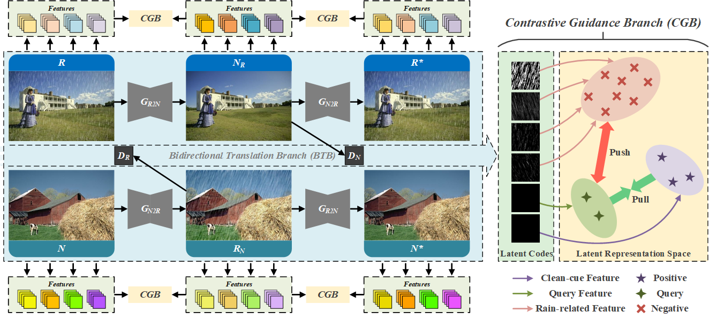

# Unpaired Deep Image Deraining Using Dual Contrastive Learning

Xiang Chen, Jinshan Pan, Kui Jiang, Yufeng Li, Yufeng Huang, Caihua Kong, Longgang Dai, Zhentao Fan

> **Abstract:** *Learning single image deraining (SID) networks from an unpaired set of clean and rainy images is practical and valuable as acquiring paired real-world data is almost infeasible. However, without the paired data as the supervision, learning a SID network is challenging. Moreover, simply using existing unpaired learning methods (e.g., unpaired adversarial learning and cycle-consistency constraints) in the SID task is insufficient to learn the underlying relationship from rainy inputs to clean outputs as there exists significant domain gap between the rainy and clean images. In this paper, we develop an effective unpaired SID adversarial framework which explores mutual properties of the unpaired exemplars by a dual contrastive learning manner in a deep feature space, named as DCD-GAN. The proposed method mainly consists of two cooperative branches: Bidirectional Translation Branch (BTB) and Contrastive Guidance Branch (CGB). Specifically, BTB exploits full advantage of the circulatory architecture of adversarial consistency to generate abundant exemplar pairs and excavates latent feature distributions between two domains by equipping it with bidirectional mapping. Simultaneously, CGB implicitly constrains the embeddings of different exemplars in the deep feature space by encouraging the similar feature distributions closer while pushing the dissimilar further away, in order to better facilitate rain removal and help image restoration. Extensive experiments demonstrate that our method performs favorably against existing unpaired deraining approaches on both synthetic and real-world datasets, and generates comparable results against several fully-supervised or semi-supervised models.* 

## Network Architecture

 

## Citation
If you are interested in this work, please consider citing:

    @inproceedings{chen2022unpaired,
        title={Unpaired Deep Image Deraining Using Dual Contrastive Learning}, 
        author={Chen, Xiang and Pan, Jinshan and Jiang, Kui and Li, Yufeng and Huang, Yufeng and Kong, Caihua and Dai, Longgang and Fan, Zhentao},
        booktitle={CVPR},
        year={2022}
    }

## Acknowledgment
This code is based on the [DCLGAN](https://github.com/JunlinHan/DCLGAN). Thanks for sharing !
